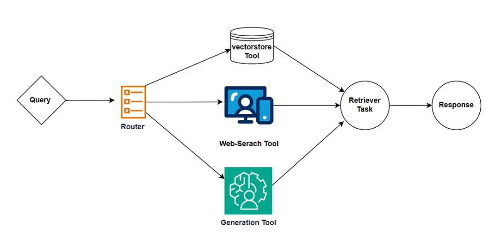

# CrewAI Project

This repository demonstrates two advanced multi-agent AI workflows using [CrewAI](https://github.com/joaomdmoura/crewAI), [LangChain](https://python.langchain.com/), and related tools.

---

## 1. multiagent.py — Tech Trend Analyzer

**Description:**
This script sets up a multi-agent system with two roles:
- **Senior Researcher:** Uncovers groundbreaking technologies in a user-specified topic.
- **Writer:** Crafts a compelling, easy-to-understand article about the topic.

**Workflow:**
- The user is prompted to enter a topic (e.g., "AI in healthcare").
- The Researcher agent investigates the latest trends, pros, cons, and market opportunities.
- The Writer agent creates a 4-paragraph markdown article based on the research.

**How to run:**
```bash
python multiagent.py
```

**Sample Output:**
```
=== CrewAI Tech Trend Analyzer ===
[INFO] Crew created successfully.
Enter topic: AI in healthcare
[INFO] Running crew for topic: AI in healthcare

=== Crew Result ===
# Advancements in AI in healthcare
...
```
The output will include a detailed report and a markdown-formatted article saved as `new-blog-post.md`.

---

## 2. rag.py — RAG (Retrieval-Augmented Generation) Pipeline

**Description:**
This code demonstrates a simple but powerful Retrieval-Augmented Generation (RAG) workflow using CrewAI agents and tools.

- **Router Agent:** Receives a user query and decides which tool is best suited to answer it:
  - If the question is about a research paper, it uses a vectorstore tool (e.g., PDF search with embeddings).
  - If the question is about current news or events, it uses a web search tool.
  - For general questions, it uses a language model (LLM) to generate a response.
- **Retriever Agent:** Uses the selected tool to find or generate the answer, and returns the response to the user.

This approach ensures that the system can:
- Quickly find relevant information from research papers using semantic search (vectorstore).
- Provide up-to-date answers for current events via web search.
- Generate helpful responses for general knowledge questions using an LLM.

**RAG Pipeline Diagram:**



**How to run:**
```bash
python rag.py
```

**Sample Output:**
```
=== RAG Pipeline ===
[INFO] RAG Crew created successfully.
Enter your question: What is Apple's stock price right now?
[INFO] Running RAG crew for question: What is Apple's stock price right now?
╭────────────────────────────── Crew Execution Started ───────────────────────────────╮
│                                                                                     │
│  Crew Execution Started                                                             │
│  Name: crew                                                                         │
│  ID: 6a4369ed-4e82-47da-a692-985e45a550b9                                           │
│                                                                                     │
│                                                                                     │
╰─────────────────────────────────────────────────────────────────────────────────────╯

# Agent: Router
## Task: Analyse the keywords in the question What is Apple's stock price right now?   
Based on the keywords decide whether it is eligible for a vectorstore search or a web  
search or generation. Return a single word 'vectorstore' if it is eligible for
vectorstore search. Return a single word 'websearch' if it is eligible for web search. 
Return a single word 'generate' if it is eligible for generation. Do not provide any   
other preamble or explanation.


# Agent: Router                                                                        
## Final Answer:                                                                       
websearch                                                                              

                                                                                       
🚀 Crew: crew
└── 📋 Task: 0a601ff9-e656-40d3-a5b2-91cbae807051
    Assigned to: Router
    Status: ✅ Completed
╭────────────────────────────────── Task Completion ──────────────────────────────────╮
│                                                                                     │
│  Task Completed                                                                     │
│  Name: 0a601ff9-e656-40d3-a5b2-91cbae807051                                         │
│  Agent: Router                                                                      │
│                                                                                     │
│                                                                                     │
╰─────────────────────────────────────────────────────────────────────────────────────╯

# Agent: Retriever
## Task: Based on the response from the router task extract information for the        
question What is Apple's stock price right now? with the help of the respective tool.  
Use the web_search_tool to retrieve information from the web in case the router task   
output is 'websearch'. Use the rag_tool to retrieve information from the vectorstore in
case the router task output is 'vectorstore'. Otherwise generate the output based on   
your own knowledge in case the router task output is 'generate'.


# Agent: Retriever                                                                     
## Thought: Action: Search                                                             
## Using tool: Search                                                                  
## Tool Input:                                                                         
"{\"query\": \"Apple stock price current\"}"                                           
## Tool Output:                                                                        
Stock Quote: NASDAQ: AAPL ; Day's Open198.24 ; Closing Price201.00 ; Volume96.8 ;      
Intraday High201.70 ; Intraday Low196.85. Strong Buy. Buy. Hold. Underperform. Sell.   
Analyst Price Targets. 170.62 Low. 228.85 Average. 201.00 Current. 300.00 High. View   
more. Research reports: AAPL. Apple Inc AAPL:NASDAQ ; Close. 201.00 quote price arrow  
up +4.42 (+2.25%) ; Volume. 85,570,161 ; 52 week range. 169.21 - 260.10. View Apple    
Inc. AAPL stock quote prices, financial information, real-time forecasts, and company  
news from CNN. Key Data. Open $198.24; Day Range 196.86 - 201.70; 52 Week Range 169.21 
- 260.10; Market Cap $3T; Shares Outstanding 14.94B; Public Float 14.92B; Beta 1.29 ...
The current price of AAPL is 201.00 USD — it has increased by 2.25% in the past 24     
hours. Watch Apple Inc stock price performance more closely on the chart. ... Convert  
Apple Inc stocks or shares into any currency with our handy tool, and you'll always    
know what you're getting. Apple Inc. NASDAQ: AAPL. 196.45 USD. Previous Close Price:   
$196.58 ; Bid/Ask: $201.29 ; Shares Outstanding: 14.94B ; Market Cap: $3.00T ;
Volume/Avg: 97M ... $260.1/$169.2101. Market Cap. 2,928,318,045,560. Annualized        
Dividend. $1.04. Ex Dividend Date. May 12, 2025. Dividend Pay Date. May 15, 2025.      
Current Yield. View the real-time AAPL price chart on Robinhood, Apple stock live quote
and latest news ... Low today$195.84. Open price. $198.12. Open price$198.12. Volume.  


# Agent: Retriever                                                                     
## Final Answer:                                                                       
The current stock price of Apple Inc (AAPL) is $201.00 USD with an increase of 2.25% in
the past 24 hours.                                                                     
                                                                                       
                                                                                       
🚀 Crew: crew                                                                          
├── 📋 Task: 0a601ff9-e656-40d3-a5b2-91cbae807051                                      
│   Assigned to: Router                                                                
│   Status: ✅ Completed                                                               
└── 📋 Task: 1e1cf554-c1b3-47ee-a901-b6115191549e                                      
    Assigned to: Retriever                                                             
    Status: ✅ Completed                                                               
    └── 🔧 Used Search (1)
╭────────────────────────────────── Task Completion ──────────────────────────────────╮
│                                                                                     │
│  Task Completed                                                                     │
│  Name: 1e1cf554-c1b3-47ee-a901-b6115191549e                                         │
│  Agent: Retriever                                                                   │
│                                                                                     │
│                                                                                     │
╰─────────────────────────────────────────────────────────────────────────────────────╯

╭────────────────────────────────── Crew Completion ──────────────────────────────────╮
│                                                                                     │
│  Crew Execution Completed                                                           │
│  Name: crew                                                                         │
│  ID: 6a4369ed-4e82-47da-a692-985e45a550b9                                           │
│                                                                                     │
│                                                                                     │
╰─────────────────────────────────────────────────────────────────────────────────────╯


=== RAG Crew Result ===
The current stock price of Apple Inc (AAPL) is $201.00 USD with an increase of 2.25% in the past 24 hours.
```
The output will show the full agent reasoning, tool usage, and the final answer based on the selected retrieval/generation strategy.

---

## Requirements

- Python 3.11
- Install dependencies:
  ```bash
  pip install -r requirements.txt
  ```

- You will need API keys for [Serper](https://serper.dev/api-key) and OpenAI, set in your environment variables or `.env` file (do **not** commit `.env`).

---

## Repository

This project is hosted at: [https://github.com/srini118us/CrewAI](https://github.com/srini118us/CrewAI)

